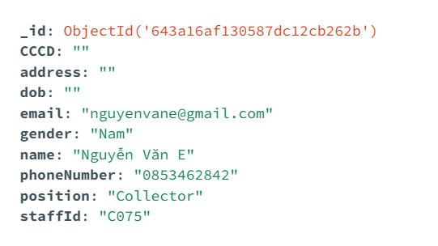
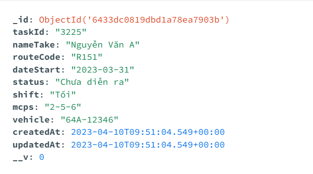

# UWC2.0: An Urban Waste Collection System

UWC2.0 is an open-source application for a Software Engineering project to resolve the urban waste management problem. This system can store and manage employee information including Back Officer (Officer in charge), Collector (Driver of collection trucks) and Janitor (collector of garbage in MCP). Furthermore, it can also provide information about time for each employee's task and create an optimal route (using Google Map API) for each collector's task.

<h2 align="center"> Demo April 27th 2023 </h2>

https://user-images.githubusercontent.com/107759618/234941483-61845bfa-da62-4add-bb9b-93cbb5672807.mp4

# User Interface

# How to use
To use the application, you will need to follow these steps:
1. Clone the repository via `git clone https://github.com/hyla167/L02-Group-4.git` and `cd` into the cloned repository
2. Download NodeJS at https://nodejs.org/ if you haven't
3. Install the require packages: `npm install`
4. Install MongoDB Compass (https://www.mongodb.com/products/compass) if you haven't
5. Create a database named "uwc_v2" and add two collections called "staffs" and "tasks"
6. Add some data to each of the collections. The data should have the following formats:
  

7. Run the application: `node server.js`. The email and password for login is `vovankha2003@gmail.com` and `admin123`

## 🚀 Features
- 🔍 Search for a task by its ID, status, date; or by collector's name.
- 🔔 Send task notification to employee.
- ✅ Confirm done tasks
- 🌈 CRUD Operations on tasks.
- 🕓 View optimize route of a collector's task

## ⚠️ Limitations
1. Route, MCP and Vehicle Management not yet implemented
2. Each route can go through at most 3 MCPs
3. The system does not have statistical information on vehicle, MCPs and staffs
4. User profile and message not yet implemented

# Contributor
We are a group of students majoring in Computer Science from Ho Chi Minh University of Technology (HCMUT).

Our members of the team:
* Lã Nguyễn Gia Hy - 2110231
* Võ Văn Khả - 2110264
* Đặng Quang Vinh - 2110667
* Nguyễn Phan Hoàng Phúc - 2110457
* Mai Đình Quốc Anh - 2012595
* Trần Đức Tiến - 2014732
* Hoàng Xuân Lộc - 2013680

# Contact
If you have any questions, please contact me via email: languyengiahy@gmail.com
